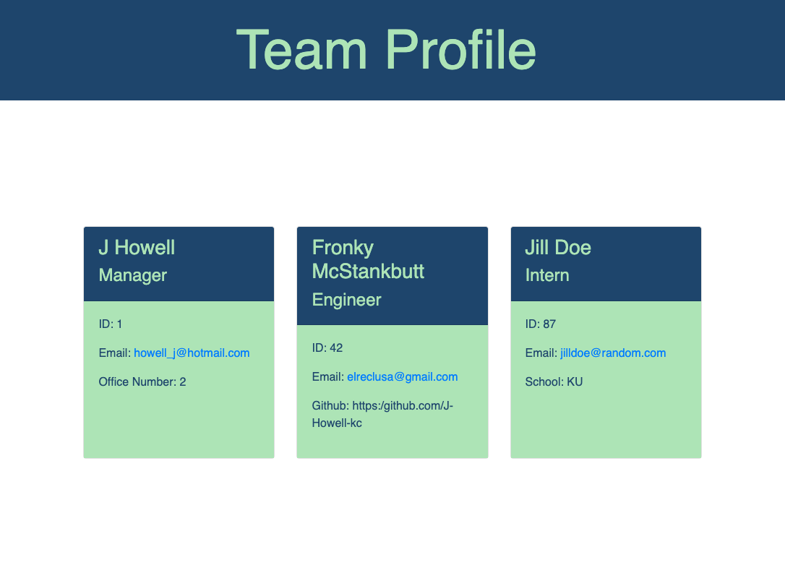

  # Title
Team Profile Generator

## Description
Creates a team profile based on user response to prompts,  using Inquirer/ Node.js, generating an HTML page with CSS.

## Table of Contents
* [Installation](#installation)
* [Usage](#usage)
* [Contributing](#contributing)
* [Tests](#tests)
* [License](#license)
* [Questions](#questions)
* [Screenshot](#screenshot)

## License
  
License Info: https://opensource.org/licenses/alphabetical 

## Installation
Clone the repo from GitHub and install Node, Inquirer and a file system (fs).

## Usage
Answer questions prompted via CLI, open index.html in live server.

## Contributing
Install and follow license requirements.

## Tests
Run index.js via CLI.

## Questions 
### GitHub Profile link
https://github.com/https:/github.com/J-Howell-kc  
### Email
Feel free to direct any questions to howell_j@hotmail.com. Thanks.

## Screenshot
;